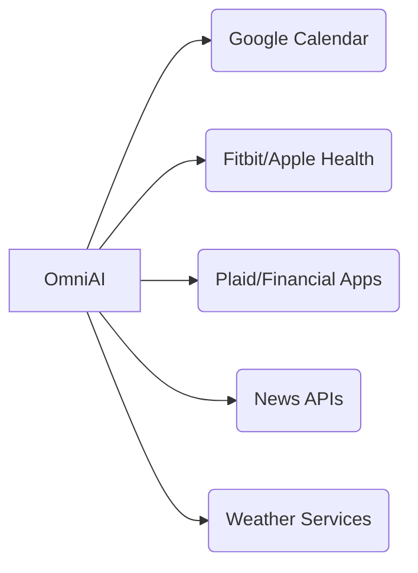

# OmniAI - Unified Personal Productivity Assistant


---

## ✨ Features

| Module      | Key Capabilities                                                      |
|-------------|-----------------------------------------------------------------------|
| **Tasks**   | AI prioritization, natural language input, subtask generation         |
| **Calendar**| Smart scheduling, conflict detection, weather-aware reminders         |
| **Health**  | Wearable integration, sleep analysis, hydration tracking              |
| **Finance** | Auto-categorization, spending alerts, net worth visualization         |
| **News**    | Personalized feed, AI summaries, sentiment analysis                   |
| **Wellness**| Stress detection, meditation guides, break suggestions                |

---

## 🚀 Quick Start

1. **Install dependencies**

   ```bash
   npm install
   ```

2. **Configure API keys**
   - Rename `.env.example` to `.env` and add your API keys.

3. **Launch the app**

   ```bash
   npm run dev
   ```

---

## 💡 Example Commands

- "Reschedule my 3PM meeting to tomorrow"
- "Show expenses from last month"
- "Add buy groceries to my tasks due today"
- "Suggest a workout based on my sleep data"

---

## 📦 Data Integration



---

## 📜 License

MIT © 2023 OmniAI Team

---

*Copy and paste this README into any Markdown viewer (GitHub, VS Code, Obsidian, etc.) for best results. The mermaid diagram will render in supported viewers.*